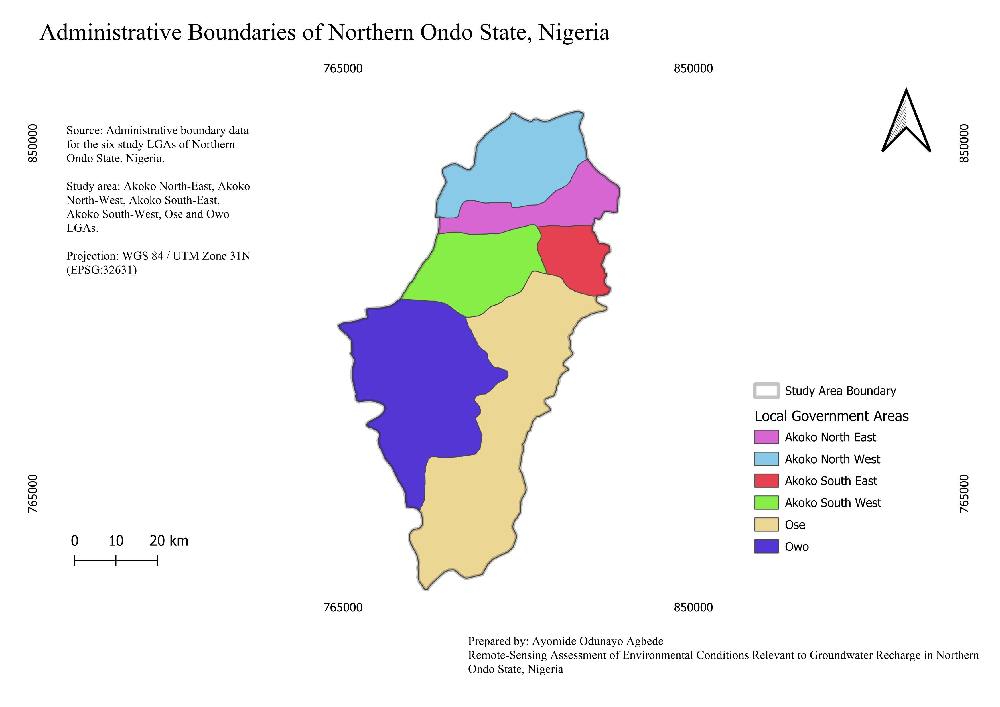
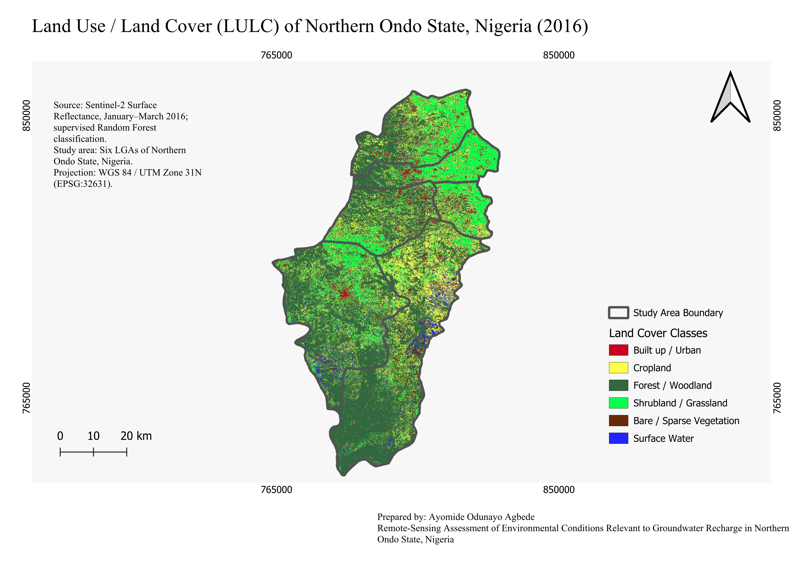
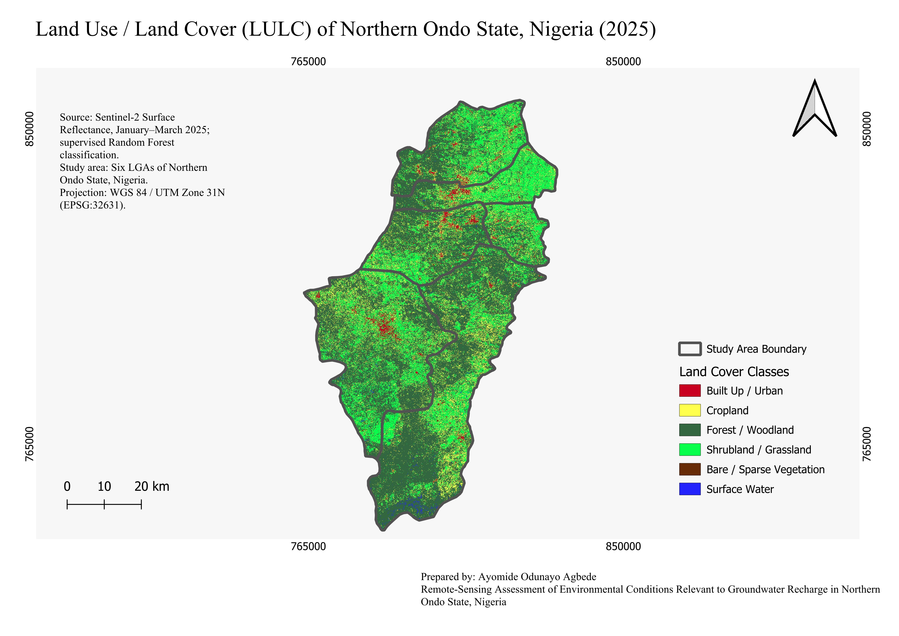
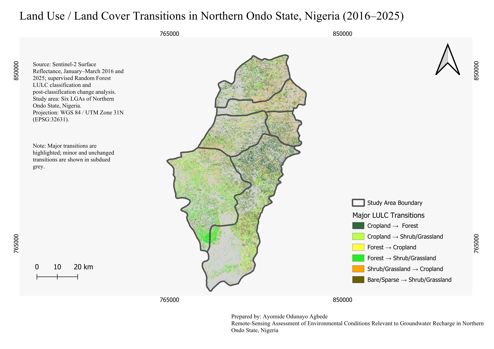
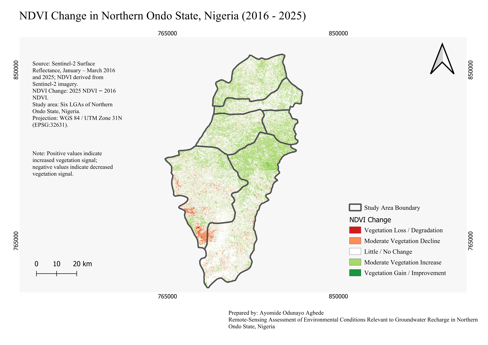
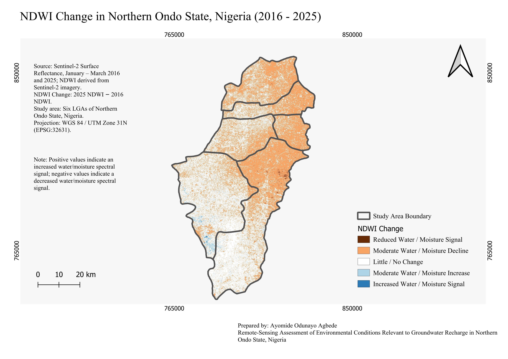
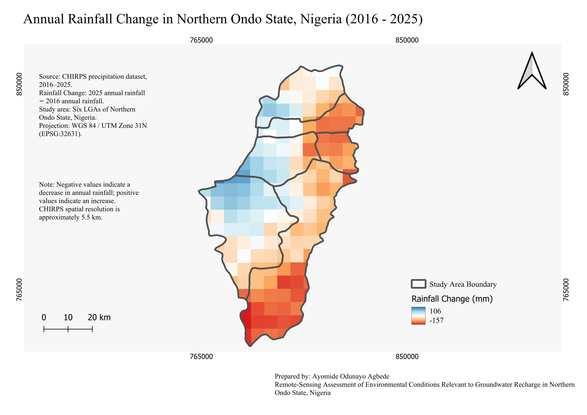

# Remote-Sensing Assessment of Environmental Conditions Relevant to Groundwater Recharge in Northern Ondo State, Nigeria

## Overview

This project uses **Google Earth Engine and QGIS** to assess changes in land use/land cover, vegetation, surface-water/moisture spectral response and rainfall across six Local Government Areas (LGAs) of Northern Ondo State, Nigeria.

The analysis covers **2016–2025** and examines how these environmental patterns relate to conditions relevant to groundwater recharge.

The study does **not** directly calculate groundwater recharge rates. Instead, it combines remotely sensed environmental indicators to provide spatial and temporal context for groundwater and water-resource investigations.

---

## Study Area

The study covers six LGAs in Northern Ondo State:

* Akoko North-East
* Akoko North-West
* Akoko South-East
* Akoko South-West
* Ose
* Owo

The analysis was carried out in **Google Earth Engine** and final maps were produced in **QGIS 3.44.9** using **WGS 84 / UTM Zone 31N (EPSG:32631)**.

---

## Aim

To assess spatial and temporal patterns in land cover, vegetation, surface water/moisture and rainfall across Northern Ondo State and examine their relevance to environmental conditions associated with groundwater recharge.

---

## Objectives

1. Assess land use/land cover characteristics and changes between 2016 and 2025.
2. Analyse vegetation dynamics using NDVI.
3. Assess surface-water/moisture spectral patterns using NDWI.
4. Examine annual and January–March rainfall variability using CHIRPS.
5. Explore relationships between rainfall, vegetation and water/moisture spectral indicators.
6. Integrate selected environmental indicators into an exploratory Environmental Conditions Index relevant to groundwater recharge.

---

## Data and Methods

### Sentinel-2

Sentinel-2 Surface Reflectance Harmonized imagery was used for:

* LULC classification
* NDVI
* NDWI
* Environmental-condition analysis

The main predictor bands were:

* B2 — Blue
* B3 — Green
* B4 — Red
* B8 — Near Infrared
* B11 — SWIR 1
* B12 — SWIR 2

January–March seasonal composites were used for the main Sentinel-2 analysis.

### CHIRPS

CHIRPS precipitation data were used to assess:

* Annual rainfall
* January–March rainfall
* Rainfall variability
* Rainfall change between 2016 and 2025

CHIRPS has an approximate spatial resolution of **5.5 km**.

### LULC Classification

Six land-cover classes were mapped:

| Class | Description              |
| ----: | ------------------------ |
|     0 | Built-up / Urban         |
|     1 | Cropland                 |
|     2 | Forest / Woodland        |
|     3 | Shrubland / Grassland    |
|     4 | Bare / Sparse Vegetation |
|     5 | Surface Water            |

A total of **44 training polygons** were used.

A Random Forest classifier with **100 trees** and **random seed 42** was used, with a 70/30 training-validation split.

Separate classifications were produced for 2016 and 2025 using the same classification framework.

---

## Key Results

### LULC Change

| Class                    | 2016 Area (km²) | 2025 Area (km²) | Change (km²) |
| ------------------------ | --------------: | --------------: | -----------: |
| Built-up / Urban         |          104.59 |           83.03 |       -21.57 |
| Cropland                 |          809.59 |          566.68 |      -242.92 |
| Forest / Woodland        |         2035.53 |         2291.76 |      +256.23 |
| Shrubland / Grassland    |          874.10 |         1181.58 |      +307.48 |
| Bare / Sparse Vegetation |          236.16 |           47.10 |      -189.06 |
| Surface Water            |          100.95 |           17.70 |       -83.25 |

The largest increase was in **Shrubland/Grassland (+307.48 km²)**, followed by **Forest/Woodland (+256.23 km²)**.

The largest decrease was in **Cropland (-242.92 km²)**.

The largest observed inter-class transition was:

**Cropland → Forest: 432.18 km²**

These classified changes do not by themselves establish the processes responsible for the changes.

### LULC Accuracy

| Year | Overall Accuracy | Kappa |
| ---- | ---------------: | ----: |
| 2016 |           92.60% | 0.902 |
| 2025 |           89.41% | 0.869 |

The validation samples were derived from manually delineated training regions, so the accuracy assessment should not be treated as independent field validation.

### NDVI

Mean January–March NDVI changed from:

**0.472 in 2016 → 0.501 in 2025**

Approximately **63.78%** of the valid comparison area showed an increase in NDVI.

### NDWI

Mean January–March NDWI changed from:

**-0.529 in 2016 → -0.550 in 2025**

Approximately **63.23%** of the valid comparison area showed a decrease in NDWI.

NDWI change represents a change in spectral water/moisture response and not direct surface-water volume change.

### Rainfall

Annual rainfall showed substantial year-to-year variability.

The fitted annual rainfall trend was:

**+4.43 mm/year**

with:

**r = 0.091, p = 0.802**

January–March rainfall had a fitted trend of:

**-2.38 mm/year**

with:

**r = -0.197, p = 0.586**

Neither trend was statistically significant.

### Correlations

| Relationship                   |      r |      p |
| ------------------------------ | -----: | -----: |
| January–March rainfall vs NDVI |  0.040 |  0.913 |
| January–March rainfall vs NDWI |  0.042 |  0.909 |
| January–March NDVI vs NDWI     | -0.917 | <0.001 |

These correlations are exploratory and do not establish causation.

### Environmental Conditions Index

An exploratory Environmental Conditions Index was created from standardized changes in:

* NDVI
* NDWI
* Annual rainfall

The index had:

* Minimum: **-1.533**
* Mean: **0.035**
* Maximum: **1.890**

The index provides a relative spatial synthesis of environmental conditions relevant to groundwater recharge. It is **not a groundwater recharge rate, recharge-potential model or direct hydrogeological measurement**.

---

## Final Maps

Eight final maps were produced in QGIS.

### Study Area



### LULC 2016



### LULC 2025



### LULC Transitions 2016–2025



### NDVI Change 2016–2025



### NDWI Change 2016–2025



### Annual Rainfall Change 2016–2025



### Exploratory Environmental Conditions Index


---

## Repository Structure

```text
Northern_Ondo_Remote_Sensing_Analysis/
│
├── README.md
│
├── data/
│   └── DATA_SOURCES.md
│
├── gee/
│   ├── 01_Sentinel2_Preprocessing.js
│   ├── 02_NDVI_NDWI.js
│   ├── 03_LULC_Classification.js
│   ├── 04_LULC_Classification.js
│   ├── 05_Temporal_Analysis.js
│   ├── 06_LULC_2016.js
│   ├── 07_Environmental_Integration.js
│   └── 08_Final_Exports.js
│
├── qgis/
│   └── Northern_Ondo_Remote_Sensing_Analysis.qgz
│
├── maps/
│   ├── Study_Area_Northern_Ondo_Six_LGAs_Map.jpeg
│   ├── LULC_2016_Map.jpeg
│   ├── LULC_2025_Map.jpeg
│   ├── LULC_Transition_2016_2025_Map.jpeg
│   ├── NDVI_Change_2016_2025_Map.jpeg
│   ├── NDWI_Change_2016_2025_Map.jpeg
│   ├── Annual_Rainfall_Change_2016_2025_Map.jpeg
│   └── Environmental_Conditions_Index_Map.jpeg
│
└── documentation/
    ├── METHODOLOGY.md
    ├── PROCESSING_NOTES.md
    └── RESULTS.md
```

---

## Software

* Google Earth Engine
* Google Cloud / Earth Engine Cloud Project
* QGIS 3.44.9
* Git / GitHub

---

## Limitations

This project provides an environmental remote-sensing assessment rather than a direct groundwater-recharge model.

Important limitations include:

* LULC accuracy was assessed using validation samples derived from manually delineated training regions.
* CHIRPS rainfall has a substantially coarser spatial resolution than Sentinel-2.
* NDVI and NDWI are indirect environmental indicators.
* LULC transitions do not establish the causes of land-cover change.
* The Environmental Conditions Index is exploratory and uses an equal-weight combination of standardized variables.
* The analysis does not directly estimate groundwater levels, aquifer properties, infiltration rates or recharge rates.

A quantitative groundwater-recharge assessment would require additional hydrogeological and hydrological data.

---

## Project Significance

This project demonstrates a **remote sensing + GIS workflow** for environmental assessment relevant to groundwater studies.

The workflow combines:

**Satellite Remote Sensing → Land-Cover Classification → Change Detection → Vegetation Analysis → Water/Moisture Analysis → Rainfall Analysis → Environmental Integration → GIS Cartography**

The results provide a basis for future integration with hydrogeological observations, groundwater-level data, geophysical investigations and hydrological modelling.

---

## Author

**Ayomide Odunayo Agbede**

Hydrogeophysicist | GIS & Remote Sensing | Hydrology & Water Resources

GitHub: **Ayomide-O-Agbede**

This project was independently developed as part of my research and portfolio work in **remote sensing, GIS, environmental assessment and water resources**.
